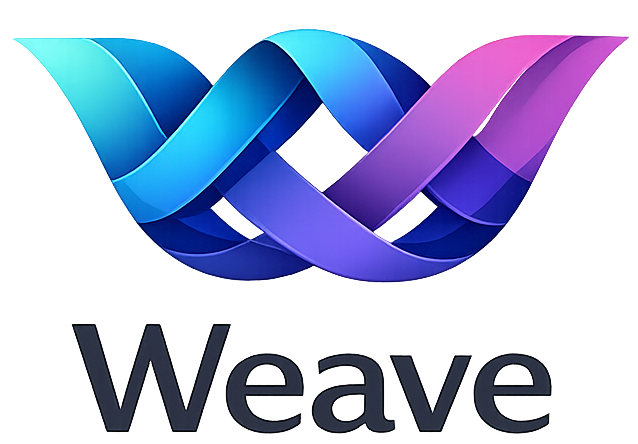

<p align="center">
  
</p>

# Weave

Weave is a lean OpenCode plugin with multi-agent orchestration. It provides a cohesive framework for weaving agents, tools, and skills into structured workflows. By delegating complex tasks to specialized agents and monitoring execution state through hooks, Weave ensures reliable and efficient project development.

## Table of Contents

- [Overview](#overview)
- [Agents](#agents)
  - [Agent Modes](#agent-modes)
  - [Agent Details](#agent-details)
- [Workflow](#workflow)
  - [When the Full Workflow Is Used](#when-the-full-workflow-is-used)
  - [1. Plan](#1-plan)
  - [2. Review (Optional)](#2-review-optional)
  - [3. Execute](#3-execute)
  - [Resuming Interrupted Work](#resuming-interrupted-work)
  - [Quick Tasks (No Plan Needed)](#quick-tasks-no-plan-needed)
- [Installation](#installation)
  - [Prerequisites](#prerequisites)
  - [Step 1: Configure authentication](#step-1-configure-authentication)
  - [Step 2: Install](#step-2-install)
  - [Step 3: Register in opencode.json](#step-3-register-in-opencodejson)
  - [Step 4: Restart OpenCode](#step-4-restart-opencode)
  - [Troubleshooting](#troubleshooting)
- [Uninstalling](#uninstalling)
- [Configuration](#configuration)
  - [Example Configuration](#example-configuration)
  - [Configuration Fields](#configuration-fields)
- [Features](#features)
  - [Hooks](#hooks)
  - [Skills](#skills)
  - [Background Agents](#background-agents)
  - [Tool Permissions](#tool-permissions)
- [Development](#development)
- [License](#license)

## Overview

- **7 specialized agents** with weaving-themed names designed for specific roles in the development lifecycle.
- **Category-based task dispatch** to route work to domain-optimized models and configurations.
- **Skill system** for injecting domain-specific expertise that modifies agent behavior via prompt orchestration.
- **Background agent management** for parallel asynchronous sub-agent execution with concurrency control.
- **Context window monitoring** to track token usage and suggest recovery strategies when limits are approached.
- **Tool permissions** enforced per-agent to ensure safety and prevent unauthorized file modifications.
- **JSONC configuration** supporting comments and trailing commas with hierarchical user and project-level merging.

## Agents

| Agent | Role | Mode | Description |
| :--- | :--- | :--- | :--- |
| **Loom** | main orchestrator | primary | The central team lead that plans tasks, coordinates work, and delegates to specialized agents. |
| **Tapestry** | execution orchestrator | primary | Manages todo-list driven execution of multi-step plans, focusing on sequential implementation without subagent spawning. |
| **Shuttle** | category worker | all | Domain-specific specialist worker with full tool access, dispatched dynamically via the category system. |
| **Pattern** | strategic planner | subagent | Analyzes requirements and produces detailed implementation plans with research and dependency mapping. |
| **Thread** | codebase explorer | subagent | Fast, read-only codebase navigation and analysis using grep, glob, and read tools. |
| **Spindle** | external researcher | subagent | Performs external documentation lookups and reference searches, providing synthesized answers with source citations. |
| **Weft** | reviewer/auditor | subagent | Reviews completed work and plans with a critical but fair eye, rejecting only for true blocking issues. |

### Agent Modes

- `primary`: Respects the user-selected model in the OpenCode UI.
- `subagent`: Uses its own model or fallback chain, ignoring UI selection for predictable specialization.
- `all`: Available in both primary and subagent contexts.

### Agent Details

**Loom** is the central orchestrator and the default entry point for every request. It breaks down complex problems into tasks, decides which agents to delegate to, and tracks progress obsessively via todo lists. Loom never implements code directly — it plans and delegates. For quick fixes it acts immediately; for complex work it kicks off the plan → review → execute workflow.

**Pattern** is the strategic planner. When a task requires 5+ steps or involves architectural decisions, Loom delegates to Pattern, which researches the codebase (via Thread) and external docs (via Spindle), then produces a structured implementation plan saved to `.weave/plans/{name}.md`. Plans use `- [ ]` checkboxes for every actionable task. Pattern never writes code — only plans.

**Weft** is the reviewer and auditor. It validates plans before execution and reviews completed work after implementation. Weft is approval-biased and only rejects for true blocking issues (max 3 per review). It checks that file references are correct, tasks have sufficient context, implementations match requirements, and no stubs or TODOs are left behind. Weft is read-only.

**Tapestry** is the execution engine. Activated by the `/start-work` command, it reads a plan from `.weave/plans/` and works through tasks sequentially — writing code, running commands, verifying output, and marking checkboxes as it goes. Tapestry cannot spawn subagents; it focuses on heads-down implementation. If interrupted, it resumes from the first unchecked task.

**Thread** is the fast codebase explorer. Loom delegates to Thread whenever it needs to understand code structure, find files, or answer questions about the repository. Thread uses grep, glob, and read tools with zero creativity (temperature 0.0) to return precise, factual answers with file paths and line numbers. Thread is read-only.

**Spindle** is the external researcher. When Loom needs documentation for a library, API reference, or any information outside the codebase, Spindle fetches URLs, reads docs, and synthesizes findings with source citations. Spindle is read-only.

**Shuttle** is the domain specialist. When work falls into a specific category (e.g., visual engineering, data processing), Loom dispatches Shuttle with full tool access to execute the task. Shuttle's model and configuration can be overridden per-category for domain-optimized performance.

## Workflow

Weave uses a structured **Plan → Review → Execute** workflow for complex tasks. Simple requests are handled directly by Loom without the full cycle.

### When the Full Workflow Is Used

- Tasks requiring 5+ steps or architectural decisions
- Multi-file refactors or new feature implementations
- Work that benefits from a reviewable plan before execution

### 1. Plan

Loom delegates to **Pattern**, which researches the codebase and produces a detailed implementation plan:

```
User Request → Loom (assesses complexity) → Pattern (researches + plans)
                                              ↓
                                     .weave/plans/{name}.md
```

The plan includes clear objectives, deliverables, and atomic tasks marked with `- [ ]` checkboxes. Pattern never writes code.

### 2. Review (Optional)

For high-stakes or complex plans, Loom delegates to **Weft** to validate the plan before execution:

```
.weave/plans/{name}.md → Weft (validates) → APPROVE or REJECT
```

Weft checks that referenced files exist, tasks have sufficient context, and there are no contradictions. If rejected, issues are sent back to Pattern for revision.

### 3. Execute

The user runs `/start-work` to begin execution:

```
/start-work [plan-name] → creates .weave/state.json → switches to Tapestry
```

**Tapestry** reads the plan and executes tasks sequentially:

1. Find the first unchecked `- [ ]` task
2. Implement the task (write code, run commands, create files)
3. Verify completion (read files, run tests, check acceptance criteria)
4. Mark the checkbox `- [x]`
5. Move to the next unchecked task
6. When all tasks are complete, report a final summary

### Resuming Interrupted Work

If a session is interrupted, running `/start-work` again resumes from the first unchecked task — no re-planning or restarting. The work state is persisted in `.weave/state.json`, so progress is never lost.

### Quick Tasks (No Plan Needed)

For simple requests — single-file fixes, quick questions, small edits — Loom handles the work directly or delegates to the appropriate agent without creating a formal plan.

## Installation

This package is published to [GitHub Packages](https://github.com/features/packages). You need to configure your package manager to use GitHub Packages for the `@pgermishuys` scope.

### Prerequisites

- [OpenCode](https://opencode.ai)
- Bun or Node.js
- A GitHub personal access token (PAT) with `read:packages` scope — [create one here](https://github.com/settings/tokens/new?scopes=read:packages)

### Step 1: Configure authentication

**Option A: Using `.npmrc`** (works with npm, Bun, yarn, pnpm)

Create or edit `~/.npmrc` (your home directory, NOT the project):

```
//npm.pkg.github.com/:_authToken=YOUR_GITHUB_PAT
@pgermishuys:registry=https://npm.pkg.github.com
```

**Option B: Using `bunfig.toml`** (Bun only)

Create or edit `~/.bunfig.toml`:

```toml
[install.scopes]
"@pgermishuys" = { token = "$GITHUB_TOKEN", url = "https://npm.pkg.github.com" }
```

Then set the environment variable: `export GITHUB_TOKEN=your_pat_here`

### Step 2: Install

```bash
bun add @pgermishuys/weave
# or
npm install @pgermishuys/weave
```

### Step 3: Register in opencode.json

Add the plugin to your `opencode.json` file:

```json
{
  "plugin": ["@pgermishuys/weave"]
}
```

### Step 4: Restart OpenCode

The plugin loads automatically upon restart and works with zero configuration out of the box.

### Troubleshooting

| Issue | Solution |
|-------|----------|
| `401 Unauthorized` | Your PAT is missing or expired. Regenerate it with `read:packages` scope. |
| `404 Not Found` | The scope registry isn't configured. Ensure your `.npmrc` or `bunfig.toml` maps `@pgermishuys` to `https://npm.pkg.github.com`. |
| `ENEEDAUTH` | npm can't find credentials. Check that `~/.npmrc` has the `_authToken` line. |
| Package not found after publish | GitHub Packages can take 1-2 minutes to propagate. Wait and retry. |

## Uninstalling

To fully remove the Weave plugin from your project:

### Step 1: Remove from opencode.json

Delete the `@pgermishuys/weave` entry from the `plugin` array in your `opencode.json`:

```json
{
  "plugin": []
}
```

### Step 2: Uninstall the package

```bash
bun remove @pgermishuys/weave
# or
npm uninstall @pgermishuys/weave
```

### Step 3: Clean up project artifacts (optional)

Weave may have created plan and state files during usage. Remove them if no longer needed:

```bash
rm -rf .weave/
```

You can also remove any project-level configuration if present:

```bash
rm -f .opencode/weave-opencode.jsonc .opencode/weave-opencode.json
```

### Step 4: Clean up user-level configuration (optional)

If you no longer use Weave in any project, remove the global configuration:

```bash
rm -f ~/.config/opencode/weave-opencode.jsonc ~/.config/opencode/weave-opencode.json
```

You may also remove the GitHub Packages authentication entries from `~/.npmrc` or `~/.bunfig.toml` if they were added solely for Weave.

## Configuration

Weave searches for configuration files in the following locations, merging them in order (user config → project config → defaults):

- **Project**: `.opencode/weave-opencode.jsonc` or `.opencode/weave-opencode.json`
- **User**: `~/.config/opencode/weave-opencode.jsonc` or `~/.config/opencode/weave-opencode.json`

The configuration uses JSONC format, allowing for comments and trailing commas.

### Example Configuration

```jsonc
{
  // Override agent models and parameters
  "agents": {
    "loom": { 
      "model": "anthropic/claude-3-5-sonnet", 
      "temperature": 0.1 
    },
    "thread": { 
      "model": "openai/gpt-4o-mini" 
    }
  },
  // Category-based dispatch overrides
  "categories": {
    "visual-engineering": { 
      "model": "google/gemini-2-pro" 
    }
  },
  // Selective feature toggling
  "disabled_hooks": [],
  "disabled_agents": [],
  "disabled_tools": [],
  "disabled_skills": [],
  // Background agent concurrency limits
  "background": {
    "defaultConcurrency": 5
  }
}
```

### Configuration Fields

- `agents` — Override model, temperature, prompt_append, tools, and skills per agent.
- `categories` — Custom model and tool configurations for category-based dispatch.
- `disabled_hooks` / `disabled_agents` / `disabled_tools` / `disabled_skills` — Selective feature disabling.
- `background` — Concurrency limits and timeouts for parallel background agents.
- `tmux` — Terminal multiplexer layout settings for TUI integration.
- `skills` — Custom skill discovery paths and recursion settings.
- `experimental` — Plugin load timeouts and context window threshold adjustments.

## Features

### Hooks

Weave includes 5 built-in hooks that monitor and modify agent behavior:

- `context-window-monitor` — Warns when token usage approaches limits and suggests recovery strategies.
- `write-existing-file-guard` — Tracks file reads to prevent agents from overwriting files they haven't examined.
- `rules-injector` — Automatically injects contextual rules when agents enter directories containing AGENTS.md.
- `first-message-variant` — Applies specific prompt variants on session start for consistent behavior.
- `keyword-detector` — Detects keywords in messages to trigger behavioral changes or agent switches.

All hooks are enabled by default and can be disabled via the `disabled_hooks` configuration.

### Skills

Skills are injectable prompt expertise loaded from markdown files (SKILL.md). They modify agent behavior by prepending domain-specific instructions to the agent's system prompt.

Skills are discovered across three scopes:
- `builtin` — Provided by the Weave plugin.
- `user` — Located in the user's global configuration directory.
- `project` — Located in the current project's `.opencode/skills/` directory.

### Background Agents

Weave supports parallel asynchronous sub-agent management via the BackgroundManager. This allows Loom to spawn multiple agents simultaneously to handle independent tasks, with configurable concurrency limits to manage API rate limits.

### Tool Permissions

Tool access is controlled per-agent to ensure safety and specialized focus. For example, **Thread** and **Spindle** are strictly read-only; they are denied access to write, edit, and task management tools. These permissions can be customized globally or per-agent in the configuration.

## Development

- **Build**: `bun run build`
- **Test**: `bun test`
- **Typecheck**: `bun run typecheck`
- **Clean**: `bun run clean`

## License

MIT
