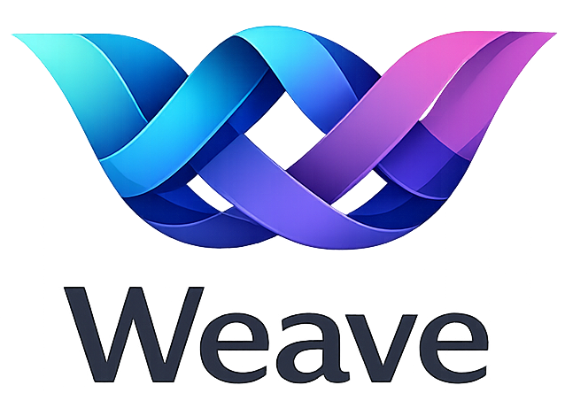

<p align="center">
  
</p>

# Weave (legacy)

> [!IMPORTANT]
> **Weave has moved to [weave-io/weave](https://github.com/weave-io/weave).** Weave isn't going away. It's under active development, and it's growing beyond OpenCode.
>
> Weave started as an OpenCode plugin, and we want to bring it to more developers than just the OpenCode community. So we rebuilt it from the ground up so it isn't tied to a single coding agent. The same agents and workflows now run on OpenCode, Claude Code, and Pi, and OpenCode is still fully supported.
>
> This repository holds the original OpenCode-only plugin (`@opencode_weave/weave`). It's no longer maintained, and all new work happens in the new repository. If you use this plugin today, follow the **[upgrade guide](https://tryweave.io/docs/upgrade-from-legacy/)** (summarized [below](#upgrading-to-the-new-weave)). It converts your config, so you keep your agents, descriptions, and prompts. Most setups take a few minutes to move over.

Weave is a lean OpenCode plugin with multi-agent orchestration. It provides a cohesive framework for weaving agents, tools, and skills into structured workflows. By delegating complex tasks to specialized agents and monitoring execution state through hooks, Weave ensures reliable and efficient project development.

## Upgrading to the new Weave

The full guide, with troubleshooting, is at **[tryweave.io/docs/upgrade-from-legacy](https://tryweave.io/docs/upgrade-from-legacy/)**. Here are the steps.

The new Weave keeps the same eight agents (Loom, Tapestry, Shuttle, Pattern, Thread, Spindle, Weft, and Warp) and the same plan-then-execute workflow. The package names and the config format are different:

| | Legacy Weave (this repo) | New Weave |
| :--- | :--- | :--- |
| OpenCode plugin | `@opencode_weave/weave` | `@weaveio/weave-adapter-opencode` |
| CLI | none | `@weaveio/weave-cli` (the `weave` command) |
| Project config | `.opencode/weave-opencode.jsonc` | `.weave/config.weave` |
| User config | `~/.config/opencode/weave-opencode.jsonc` | `~/.weave/config.weave` |
| Config format | JSONC | `.weave` DSL |
| Harnesses | OpenCode | OpenCode, Claude Code, Pi |
| Start a plan | `/start-work` | `/weave:start` (`/start-work` still works as an alias) |

### Step 1: Install the Weave CLI

The CLI needs [Bun](https://bun.sh). It doesn't run on Node.js.

```bash
bun add --global @weaveio/weave-cli@0.2.0
weave --version
```

### Step 2: Migrate your config

`weave init migrate` converts your legacy JSONC config into the new `.weave` DSL. Run it once for each config you have:

```bash
# Project config: .opencode/weave-opencode.jsonc -> .weave/config.weave
# (run this from the project root)
weave init migrate --scope local

# User config: ~/.config/opencode/weave-opencode.jsonc -> ~/.weave/config.weave
weave init migrate --scope global
```

Before you run it:

- **Give every category a `description`.** The new Weave requires one, and migration skips a category without one (and its `shuttle-<category>` agent). Add it to the legacy file before migrating.
- **Only `.jsonc` files are picked up.** If your config is `weave-opencode.json`, rename it to `weave-opencode.jsonc` first. Plain JSON is valid JSONC, so the contents don't need to change.
- **Your legacy file isn't touched.** Migration only reads it, so you can go back if you need to.
- **Comments and trailing commas are fine.** If the file can't be parsed at all, migration exits with an error and writes nothing.

What carries over:

- Agent overrides, custom agents, categories, `log_level`, and the disabled agents, hooks, and skills lists.
- Custom agent descriptions (falling back to `display_name`) and prompts. A `prompt_file` is read the way the legacy plugin read it, relative to `.opencode/` (or `~/.config/opencode/` for the user config), and copied to `.weave/prompts/<agent>.md`.
- Models written as `provider/model`, such as `anthropic/claude-sonnet-4-5`.

What doesn't carry over. Each item is printed as a warning after migration and recorded as a comment at the top of the new `config.weave`:

- `skill_directories`: move or symlink the skills into `.opencode/skills/`.
- `disabled_tools`: use `tool_policy` instead.
- Agent and custom agent `skills`.
- Custom agent `triggers`: the `{ domain, trigger }` objects aren't converted. Add plain string triggers if you want Loom to route to the agent.
- Category `patterns`: categories now route by their description and triggers, not by file path.
- `workflows`, `continuation`, `background`, `tmux`, `experimental`, and `analytics`.
- Builtin agent `prompt` and `prompt_file` overrides. The legacy plugin ignored these too.
- `variant` on an agent or category. The new DSL supports `variant`, so add it back by hand.
- Fields with no current equivalent: `top_p`, `maxTokens`, `modelOptions`, `review_models`, `cost`, `category`, and `disable`.
- Any custom agent that reuses a builtin agent name, or that ends up with no prompt.

Migration never adds settings you didn't have. Add anything you still need by hand using the [DSL configuration reference](https://tryweave.io/docs/dsl-configuration/).

If you never customized the legacy config, there's nothing to migrate. Run `weave init --scope local --yes` to create a fresh config instead.

### Step 3: Validate the result

Run this from the project root, with no flags. It checks the merged project and user config, and names any agent the new plugin couldn't register, such as one with a missing prompt file. Fix what it reports and run it again until it passes.

```bash
weave validate
weave prompt inspect loom   # optional: see the composed prompt for an agent
```

### Step 4: Swap the plugin in `opencode.json`

Remove the legacy plugin and add the new adapter. Don't run both at the same time.

```diff
 {
-  "plugin": ["@opencode_weave/weave"]
+  "plugin": ["@weaveio/weave-adapter-opencode@0.2.0"]
 }
```

Use `0.2.0` or later. Earlier versions of the adapter can't resolve the builtin agents' default model.

### Step 5: Restart OpenCode and verify

```bash
opencode debug config
```

The resolved config should list `@weaveio/weave-adapter-opencode` and no longer list `@opencode_weave/weave`.

**One difference to expect:** for an agent with no configured model, the legacy plugin picked one from a built-in list (`github-copilot/*`, then `anthropic/*`, then `openai/*` models you had available). The new Weave uses your OpenCode model instead. To pin an agent's model, add `models ["provider/model"]` to it in `config.weave`.

### Step 6: Clean up

Once everything works, delete the legacy config files:

```bash
rm -f .opencode/weave-opencode.jsonc .opencode/weave-opencode.json
rm -f ~/.config/opencode/weave-opencode.jsonc ~/.config/opencode/weave-opencode.json
```

**Keep the `.weave/` directory.** The new Weave stores its config there too, and it reads existing plans from `.weave/plans/`.

### Getting help

- Full upgrade guide, with troubleshooting: [tryweave.io/docs/upgrade-from-legacy](https://tryweave.io/docs/upgrade-from-legacy/)
- New Weave docs: [tryweave.io/docs](https://tryweave.io/docs/quickstart/), including the [OpenCode install guide](https://tryweave.io/docs/install-opencode/) and the [`weave init migrate` reference](https://tryweave.io/docs/cli/#weave-init-migrate)
- Migration warnings: [Troubleshooting](https://tryweave.io/docs/troubleshooting/#migration-warnings)
- Bugs and questions: open an issue on [weave-io/weave](https://github.com/weave-io/weave/issues), not this repository

---

_The rest of this README documents the legacy plugin, for anyone who hasn't upgraded yet._

## Overview

- **8 specialized agents** with weaving-themed names designed for specific roles in the development lifecycle.
- **Category-based task dispatch** to route work to domain-optimized models and configurations.
- **Skill system** for injecting domain-specific expertise that modifies agent behavior via prompt orchestration.
- **Background agent management** for parallel asynchronous sub-agent execution with concurrency control.
- **Context window monitoring** to track token usage and suggest recovery strategies when limits are approached.
- **Tool permissions** enforced per-agent to ensure safety and prevent unauthorized file modifications.
- **JSONC configuration** supporting comments and trailing commas with hierarchical user and project-level merging.

## Documentation

[tryweave.io/docs](https://tryweave.io/docs/) now documents the **new** Weave. The legacy plugin's reference docs are in this repository's [`docs/`](docs/) folder, for example [configuration](docs/configuration.md) and [architecture](docs/architecture.md).

For agent routing eval trends and dashboards, see the **[Eval Dashboard](https://tryweave.io/evals/)**.

### Config schema

Weave ships a generated config schema at `schema/weave-config.schema.json` in this repository.

- Regenerate it: `bun run schema:config`
- Verify it is current: `bun run schema:config:check`
- Use it in config files via `$schema`, preferably pinned to a release tag such as `https://raw.githubusercontent.com/pgermishuys/opencode-weave/v0.7.6/schema/weave-config.schema.json`

The npm package currently publishes `dist/` only, so if you want a local `$schema` path you should vendor `schema/weave-config.schema.json` into your own repository. Runtime config still supports JSONC comments and trailing commas even though the published schema artifact is plain JSON.

## Agents

| Agent | Role | Mode | Description |
| :--- | :--- | :--- | :--- |
| **Loom** | main orchestrator | primary | The central team lead that plans tasks, coordinates work, and delegates to specialized agents. |
| **Tapestry** | execution orchestrator | primary | Manages todo-list driven execution of multi-step plans, focusing on sequential implementation without subagent spawning. |
| **Shuttle** | category worker | all | Domain-specific specialist worker with full tool access, dispatched dynamically via the category system. |
| **Pattern** | strategic planner | subagent | Analyzes requirements and produces detailed implementation plans with research and dependency mapping. |
| **Thread** | codebase explorer | subagent | Fast, read-only codebase navigation and analysis using grep, glob, and read tools. |
| **Spindle** | external researcher | subagent | Performs external documentation lookups and reference searches, providing synthesized answers with source citations. |
| **Weft** | reviewer/auditor | subagent | Reviews completed work and plans with a critical but fair eye, rejecting only for true blocking issues. |
| **Warp** | security auditor | subagent | Audits code changes for security vulnerabilities and specification compliance with a skeptical bias. |

## Installation

> [!NOTE]
> Starting fresh? Install the [new Weave](https://github.com/weave-io/weave) instead. These steps are only for existing setups that still need the legacy plugin.

This package is published on [npm](https://www.npmjs.com/package/@opencode_weave/weave).

### Prerequisites

- [OpenCode](https://opencode.ai)

### Step 1: Add to opencode.json

Add the plugin to your `opencode.json` file:

```json
{
  "plugin": ["@opencode_weave/weave"]
}
```

### Step 2: Restart OpenCode

OpenCode automatically installs npm plugins at startup — no manual `bun add` or `npm install` required. The plugin loads automatically upon restart and works with zero configuration out of the box.

### Troubleshooting

| Issue | Solution |
|-------|----------|
| `404 Not Found` | Ensure the package name is correct: `@opencode_weave/weave`. |
| Package not found after publish | npm can take a few minutes to propagate. Wait and retry. |

## Uninstalling

To fully remove the Weave plugin from your project:

### Step 1: Remove from opencode.json

Delete the `@opencode_weave/weave` entry from the `plugin` array in your `opencode.json`:

```json
{
  "plugin": []
}
```

### Step 2: Clean up project artifacts (optional)

Weave may have created plan and state files during usage. Remove them if no longer needed:

```bash
rm -rf .weave/
```

> [!WARNING]
> Skip this step if you're [upgrading to the new Weave](#upgrading-to-the-new-weave). The new Weave keeps its config in `.weave/config.weave` and reads plans from `.weave/plans/`, so deleting `.weave/` would remove them.

You can also remove any project-level configuration if present:

```bash
rm -f .opencode/weave-opencode.jsonc .opencode/weave-opencode.json
```

### Step 3: Clean up user-level configuration (optional)

If you no longer use Weave in any project, remove the global configuration:

```bash
rm -f ~/.config/opencode/weave-opencode.jsonc ~/.config/opencode/weave-opencode.json
```

## Development

- **Build**: `bun run build`
- **Test**: `bun test`
- **Typecheck**: `bun run typecheck`
- **Clean**: `bun run clean`

## Acknowledgments

Weave was inspired by [Oh My OpenCode](https://github.com/code-yeongyu/oh-my-opencode) by [@code-yeongyu](https://github.com/code-yeongyu) — a pioneering OpenCode plugin that proved multi-agent orchestration, discipline agents, and structured plan-execute workflows could radically improve the developer experience. Many of Weave's core ideas — from category-based task dispatch to background agent parallelism — trace their roots to patterns Oh My OpenCode established. We're grateful for the trailblazing work and the vibrant community around it.

## License

MIT
