# Agent Interactions & Sequence Diagrams

This document describes how Weave's agents interact, delegate work, and execute plans.

## Agent Hierarchy


### Delegation Rules

| From | To | When |
|------|----|------|
| Loom | Thread | Need to search/read code quickly |
| Loom | Spindle | Need external documentation or research |
| Loom | Pattern | Complex task needs a structured plan before execution |
| Loom | Weft | Work or plan needs review before shipping |
| Loom | Warp | Security-relevant changes need auditing |
| Loom | Shuttle | Domain-specific task with category config |
| Loom | Tapestry | *(indirect)* User runs `/start-work` to begin plan execution |
| Tapestry | *(none)* | Tapestry never delegates — executes directly |
| Pattern | *(none)* | Pattern only writes `.md` plans, never delegates |
| Thread | *(none)* | Read-only exploration, no delegation |
| Spindle | *(none)* | Read-only research, no delegation |
| Weft | *(none)* | Read-only review, no delegation |
| Warp | *(none)* | Read-only security audit, no delegation |

## Workflow A: Plan-Based Execution (Primary Flow)

This is the core workflow for complex, multi-step tasks.

```mermaid
sequenceDiagram
    actor User
    participant Loom
    participant Thread
    participant Pattern
    participant Weft
    participant Tapestry

    User->>Loom: "Build an OAuth2 login system"

    Note over Loom: Break down the request,<br/>delegate exploration first

    Loom->>Thread: Explore auth-related code,<br/>existing patterns, dependencies
    Thread-->>Loom: Found Express routes in src/auth/,<br/>PostgreSQL DB, existing session mgmt

    Note over Loom: Enough context gathered,<br/>delegate planning

    Loom->>Pattern: Create plan for OAuth2 implementation<br/>with context from Thread
    Pattern->>Pattern: Research codebase (read files)
    Pattern->>Pattern: Write .weave/plans/oauth2-login.md
    Pattern-->>Loom: Plan created with 5 tasks

    Note over Loom: Optionally review the plan

    Loom->>Weft: Review the plan for completeness
    Weft-->>Loom: [APPROVE] Plan is solid

    Loom-->>User: Plan ready. Run /start-work to begin.

    User->>Tapestry: /start-work oauth2-login

    Note over Tapestry: start-work hook fires:<br/>1. Find plan file<br/>2. Create .weave/state.json<br/>3. Switch agent to Tapestry

    loop For each unchecked task
        Tapestry->>Tapestry: Read task + acceptance criteria
        Tapestry->>Tapestry: Execute (write code, create files)
        Tapestry->>Tapestry: Verify (run tests, read output)
        Tapestry->>Tapestry: Mark checkbox: - [ ] → - [x]
        Tapestry-->>User: Progress: 3/5 tasks complete
    end

    Tapestry-->>User: ✓ All 5/5 tasks complete
```



## Workflow B: Quick Delegation (No Plan Needed)

For simpler tasks, Loom delegates directly without creating a plan.


## Workflow C: Review After Implementation

```mermaid
sequenceDiagram
    actor User
    participant Loom
    participant Weft

    User->>Loom: "Review what we just implemented"

    Loom->>Weft: Review changes in src/auth/<br/>Check for security issues,<br/>test coverage, code quality
    
    alt Approved
        Weft-->>Loom: [APPROVE] Changes look good.<br/>Tests pass, no security issues.
        Loom-->>User: ✓ Review passed
    else Rejected
        Weft-->>Loom: [REJECT]<br/>1. Missing CSRF protection<br/>2. No rate limiting on login endpoint
        Loom-->>User: Review found 2 blocking issues…
        Note over Loom: Address issues, then re-review
    end
```



## Workflow D: Session Idle & Work Continuation

When a session goes idle with incomplete work:

```mermaid
sequenceDiagram
    participant OC as OpenCode
    participant Hook as workContinuation Hook
    participant WS as Work State
    participant Tapestry

    OC->>Hook: event: session.idle
    Hook->>WS: readWorkState()
    WS-->>Hook: { active_plan: "oauth2-login",<br/>plan_name: "oauth2-login" }
    
    Hook->>WS: getPlanProgress(planPath)
    WS-->>Hook: { total: 5, completed: 3,<br/>isComplete: false }

    Hook-->>OC: Continuation prompt:<br/>"Active work: oauth2-login<br/>3/5 tasks done. Continue<br/>from first unchecked task."

    OC->>Tapestry: (resumes execution)
    Tapestry->>Tapestry: Find first unchecked - [ ] task
    Tapestry->>Tapestry: Continue execution…
```



## Workflow E: Category-Based Specialization

When config defines domain categories:

```mermaid
sequenceDiagram
    actor User
    participant Loom
    participant Shuttle

    Note over User,Shuttle: Config: categories.frontend = { model: "gpt-5", temp: 0.3 }

    User->>Loom: "Add dark mode toggle to settings page"

    Loom->>Shuttle: Task with category="frontend"
    Note over Shuttle: Uses category model (gpt-5)<br/>Category temperature (0.3)<br/>Frontend skills injected

    Shuttle->>Shuttle: Implement dark mode toggle
    Shuttle-->>Loom: Component created, styles applied
    Loom-->>User: Dark mode toggle added ✓
```



## Hook Interactions During a Request

Every user message passes through multiple hooks:


## Plan File Lifecycle


## Work State (`state.json`) Lifecycle


## Agent Capability Matrix

```
                 Read  Write  Edit  Task  WebFetch  Glob  Grep  Bash
Loom              ✓     ✓      ✓     ✓      ✓       ✓     ✓     ✓
Tapestry          ✓     ✓      ✓     ✗      ✓       ✓     ✓     ✓
Pattern           ✓    .md*   .md*   ✗      ✓       ✓     ✓     ✓
Thread            ✓     ✗      ✗     ✗      ✓       ✓     ✓     ✓
Spindle           ✓     ✗      ✗     ✗      ✓       ✓     ✓     ✓
Weft              ✓     ✗      ✗     ✗      ✓       ✓     ✓     ✓
Shuttle           ✓     ✓      ✓     ✓      ✓       ✓     ✓     ✓

✓ = allowed    ✗ = disabled    * = restricted to .weave/*.md only
```
