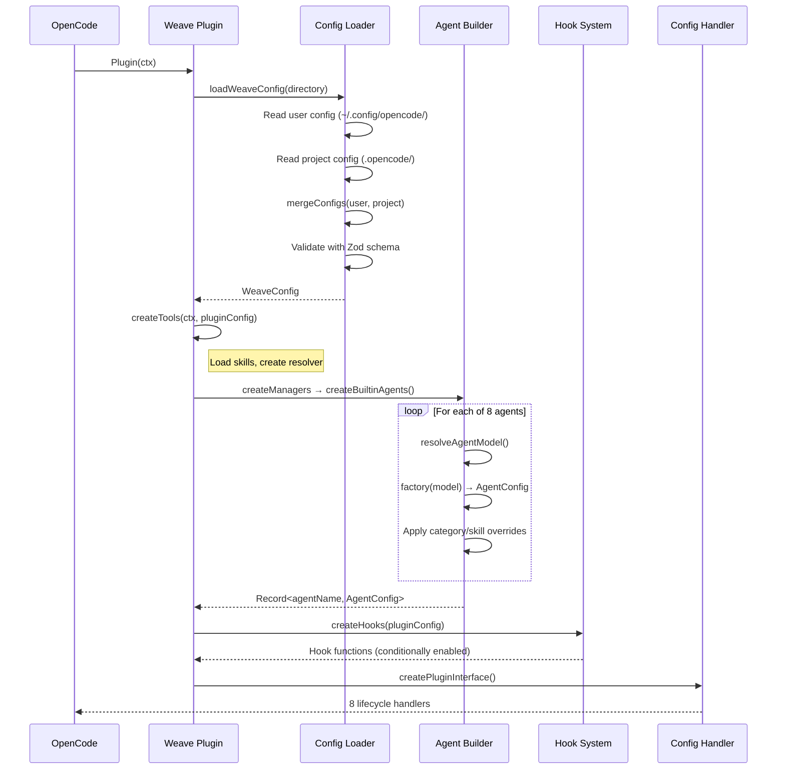
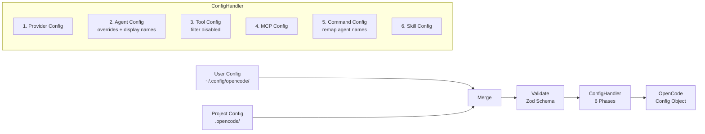

# Weave Architecture

Weave is a OpenCode plugin that orchestrates multi-agent AI workflows. It provides **8 specialized agents**, a **plan-based execution model**, a **hook-driven governance system**, and a **layered configuration pipeline**.

## High-Level Overview

```
┌─────────────────────────────────────────────────────────────────┐
│                        OpenCode (Host)                       │
│                                                                 │
│  ┌───────────────────────────────────────────────────────────┐  │
│  │                    Weave Plugin Interface                 │  │
│  │  8 lifecycle handlers: config, chat.message, tool.before… │  │
│  └────────────────────────────┬──────────────────────────────┘  │
│                               │                                 │
│  ┌────────────────────────────▼──────────────────────────────┐  │
│  │                      Plugin Core                          │  │
│  │                                                           │  │
│  │  ┌─────────┐ ┌──────────┐ ┌────────┐ ┌───────────────┐   │  │
│  │  │ Agents  │ │  Hooks   │ │ Tools  │ │   Managers    │   │  │
│  │  │ Builder │ │  System  │ │Registry│ │ Config/BG/MCP │   │  │
│  │  └────┬────┘ └────┬─────┘ └───┬────┘ └──────┬────────┘   │  │
│  │       │           │           │              │            │  │
│  │  ┌────▼───────────▼───────────▼──────────────▼────────┐   │  │
│  │  │              Config Pipeline (6 phases)            │   │  │
│  │  │  load → merge → validate → build → filter → emit  │   │  │
│  │  └────────────────────────────────────────────────────┘   │  │
│  │                                                           │  │
│  │  ┌────────────────────────────────────────────────────┐   │  │
│  │  │                   Features                         │   │  │
│  │  │  Skills │ Work State │ Builtin Commands            │   │  │
│  │  └────────────────────────────────────────────────────┘   │  │
│  └───────────────────────────────────────────────────────────┘  │
└─────────────────────────────────────────────────────────────────┘
```

## Initialization Sequence

When OpenCode loads Weave, the following happens:



## Component Map

| Component | Location | Purpose |
|-----------|----------|---------|
| Entry Point | `src/index.ts` | Plugin initialization & orchestration |
| Plugin Interface | `src/plugin/plugin-interface.ts` | 8 OpenCode lifecycle handlers |
| Agent Definitions | `src/agents/{name}/default.ts` | Per-agent prompts & configurations |
| Agent Builder | `src/agents/agent-builder.ts` | Model resolution, factory, skill injection |
| Agent Registry | `src/agents/builtin-agents.ts` | 8 agent registrations with metadata |
| Hooks | `src/hooks/*.ts` | Lifecycle callbacks for governance |
| Work State | `src/features/work-state/` | Plan progress tracking & resumption |
| Commands | `src/features/builtin-commands/` | `/start-work` command |
| Config Loader | `src/config/loader.ts` | Load & merge user/project configs |
| Config Schema | `src/config/schema.ts` | Zod validation |
| Config Pipeline | `src/managers/config-handler.ts` | 6-phase transformation |
| Tools | `src/tools/` | Tool registry & per-agent permissions |
| Skills | `src/features/skill-loader/` | Skill discovery & resolution |
| Managers | `src/managers/` | ConfigHandler, BackgroundManager, SkillMcpManager |

## The Agent System

Weave defines **8 specialized agents**, each with a distinct role and set of constraints:

| Agent | Role | Mode | Cost | Tool Access |
|-------|------|------|------|-------------|
| **Loom** | Main orchestrator — plans tasks, delegates work | primary | expensive | Full |
| **Tapestry** | Execution engine — works through plan checkboxes | primary | expensive | Full (no subagents) |
| **Shuttle** | Category specialist — domain-specific work | all | cheap | Full |
| **Pattern** | Strategic planner — creates `.md` plan files | subagent | expensive | Guarded (`.weave/` only) |
| **Thread** | Codebase explorer — fast search & analysis | subagent | free | Read-only |
| **Spindle** | External researcher — docs & web lookup | subagent | free | Read-only |
| **Weft** | Reviewer/auditor — approves or rejects work | subagent | free | Read-only |
| **Warp** | Security auditor — flags vulnerabilities and spec violations | subagent | expensive | Read-only |

### Agent Modes

- **primary**: Respects the user's UI-selected model (Loom, Tapestry)
- **subagent**: Uses its own fallback chain, ignores UI selection (Pattern, Thread, Spindle, Weft, Warp)
- **all**: Available in both primary and subagent contexts (Shuttle)

### Model Resolution Priority

```
1. Config override (agents.{name}.model)
2. UI-selected model (primary/all modes only)
3. Category model (if assigned)
4. Agent's fallback chain (anthropic → openai → google → …)
5. System default
```

### Key Invariants

- **Pattern** can only write `.md` files inside `.weave/` (enforced by hook)
- **Tapestry** never spawns subagents — executes tasks directly
- **Thread / Spindle / Weft / Warp** are read-only (write/edit tools disabled)
- **Warp** has a skeptical security bias (rejects by default on security patterns)
- **Loom** is the only agent that delegates to all others

## The Hook System

Hooks are lifecycle callbacks that govern agent behavior. They are conditionally enabled via the `disabled_hooks` config.

| Hook | Trigger | Purpose |
|------|---------|---------|
| `startWork` | `chat.message` with `/start-work` | Parse plan, create work state, switch to Tapestry |
| `workContinuation` | `session.idle` event | Generate continuation prompt for incomplete plans |
| `patternMdOnly` | `tool.execute.before` (Pattern) | Block writes outside `.weave/` or non-`.md` files |
| `contextWindowMonitor` | `chat.message` | Warn at 80%, recover at 95% token usage |
| `writeGuard` | `tool.execute.before` | Track file reads, validate writes target known files |
| `rulesInjector` | `tool.execute.before` | Load `AGENTS.md` / `.rules` / `CLAUDE.md` |
| `keywordDetector` | `chat.message` | Detect keywords like "ultrawork" / "ulw" |
| `verificationReminder` | `chat.message` | Remind agents to verify their work |
| `firstMessageVariant` | `chat.message` | Track session state |

## Config Pipeline

Configuration flows through a 6-phase pipeline:



**Merge strategy:**
- Nested objects (agents, categories): deep merge, project overrides user
- Arrays (disabled_*): union with deduplication
- Scalars: project value wins

## Skills

Skills are injectable prompt fragments that augment agent behavior:

```
Scan directories → Parse frontmatter → Merge (project > user > builtin) → Filter disabled → Inject into agent prompts
```

Skill sources (in priority order):
1. **Project**: `.opencode/skills/`
2. **User**: `~/.config/opencode/weave-opencode/skills/`
3. **Builtin**: Weave's bundled skills

## Further Reading

- [Agent Interactions & Sequence Diagrams](./agent-interactions.md) — How agents delegate, communicate, and execute plans
- [Configuration Reference](./configuration.md) — Full config schema, examples, and the 6-phase pipeline
