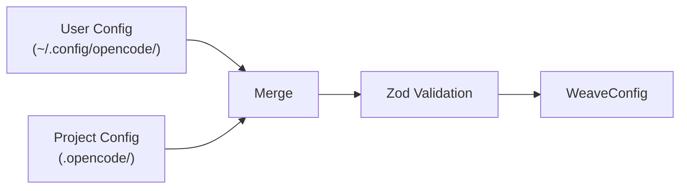
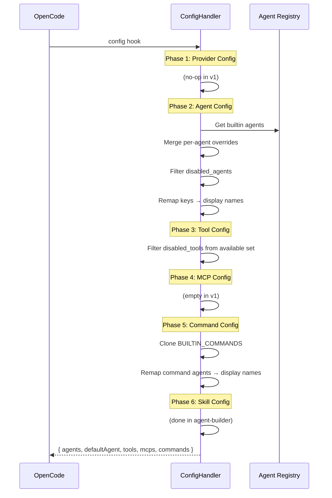
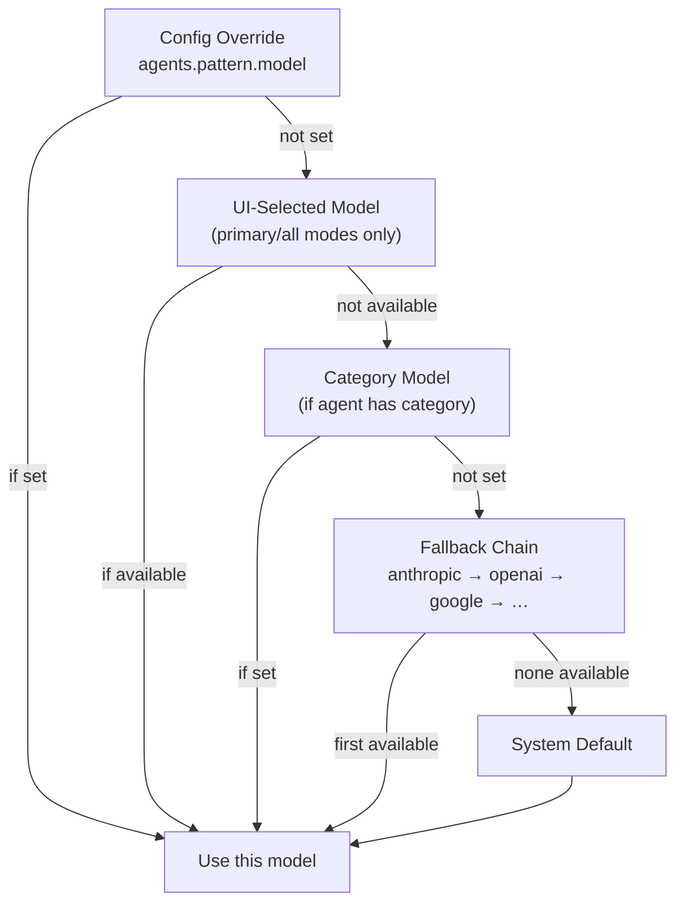

# Configuration Reference

Weave supports layered configuration through JSONC or JSON files at two levels.

## Config File Locations

| Level | Path | Priority |
|-------|------|----------|
| **Project** | `.opencode/weave-opencode.jsonc` (or `.json`) | Highest (overrides user) |
| **User** | `~/.config/opencode/weave-opencode.jsonc` (or `.json`) | Lowest (defaults) |

## Merge Strategy



- **Nested objects** (agents, categories): deep merge — project keys override user keys recursively
- **Arrays** (disabled_*): union with deduplication — both sets combined
- **Scalars**: project value wins over user value

## Full Schema

```jsonc
{
  // Per-agent overrides
  "agents": {
    "<agent-name>": {
      "model": "provider/model-name",      // Override model
      "temperature": 0.5,                   // 0-2
      "variant": "custom-variant-name",     // Prompt variant
      "skills": ["skill-1", "skill-2"],     // Inject skills
      "prompt_append": "Extra instructions", // Append to prompt
      "tools": {                            // Per-tool toggles
        "bash": true,
        "write": false
      },
      "disable": false                      // Remove agent entirely
    }
  },

  // Domain-optimized model groups
  "categories": {
    "<category-name>": {
      "description": "What this category does",
      "model": "provider/model-name",
      "temperature": 0.3,
      "variant": "category-variant",
      "tools": { "bash": true }
    }
  },

  // Disable specific lifecycle hooks
  "disabled_hooks": [
    "context-window-monitor",
    "keyword-detector"
  ],

  // Hide tools from all agents
  "disabled_tools": ["some-tool-name"],

  // Exclude agents from the UI
  "disabled_agents": ["spindle"],

  // Filter skill loading
  "disabled_skills": ["some-skill"],

  // Background task concurrency
  "background": {
    "defaultConcurrency": 3,
    "providerConcurrency": {
      "anthropic": 5,
      "openai": 3
    },
    "modelConcurrency": {
      "claude-sonnet-4-20250514": 10
    },
    "staleTimeoutMs": 60000
  },

  // Terminal multiplexing (stub)
  "tmux": {
    "enabled": false,
    "layout": "default"
  },

  // Skill discovery paths
  "skills": {
    "paths": ["./.custom-skills"],
    "recursive": true
  },

  // Experimental features
  "experimental": {
    "plugin_load_timeout_ms": 5000,
    "context_window_warning_threshold": 0.8,
    "context_window_critical_threshold": 0.95
  }
}
```

## Agent Names

Valid agent names for the `agents` config key:

| Config Key | Display Name | Default Role |
|------------|-------------|-------------|
| `loom` | Loom (Main Orchestrator) | Primary orchestrator |
| `tapestry` | Tapestry (Execution Orchestrator) | Plan executor |
| `pattern` | pattern | Strategic planner |
| `thread` | thread | Codebase explorer |
| `spindle` | spindle | External researcher |
| `weft` | weft | Reviewer/auditor |
| `warp` | warp | Security auditor |
| `shuttle` | shuttle | Category specialist |

> **Note**: Loom and Tapestry get title-cased display names with role descriptions. Subagents keep lowercase names.

## Config Pipeline (6 Phases)

When the plugin initializes, `ConfigHandler` transforms the merged config into OpenCode's expected format:



### Output Applied to OpenCode

```typescript
config.agent = result.agents           // Register all agent configs
config.command = result.commands       // Register /start-work
config.default_agent = result.defaultAgent // "Loom (Main Orchestrator)"
```

## Model Resolution

Each agent resolves its model through a priority chain:



### Per-Agent Fallback Chains

| Agent | Fallback Priority |
|-------|------------------|
| Loom | anthropic → openai → google |
| Tapestry | anthropic → openai → google |
| Pattern | anthropic → openai → google |
| Thread | anthropic → openai → google |
| Spindle | anthropic → openai → google |
| Weft | anthropic → openai → google |
| Warp | anthropic → openai → google |
| Shuttle | *(uses category model or default)* |

## Examples

### Override Pattern to use a different model

```jsonc
{
  "agents": {
    "pattern": {
      "model": "openai/gpt-5",
      "temperature": 0.5
    }
  }
}
```

### Set up domain categories

```jsonc
{
  "categories": {
    "backend": {
      "description": "Backend API development",
      "model": "anthropic/claude-opus-4",
      "temperature": 0.1
    },
    "frontend": {
      "description": "React/UI development",
      "model": "openai/gpt-5",
      "temperature": 0.3
    }
  }
}
```

### Disable agents and hooks

```jsonc
{
  "disabled_agents": ["spindle"],
  "disabled_hooks": ["context-window-monitor", "keyword-detector"],
  "disabled_tools": ["webfetch"]
}
```

### Custom skill paths

```jsonc
{
  "skills": {
    "paths": ["./.custom-skills", "../shared-skills"],
    "recursive": true
  },
  "agents": {
    "pattern": {
      "skills": ["planning-guidelines"]
    },
    "shuttle": {
      "skills": ["react-best-practices", "api-design"]
    }
  }
}
```

### Tune background concurrency

```jsonc
{
  "background": {
    "defaultConcurrency": 2,
    "providerConcurrency": {
      "anthropic": 5,
      "openai": 3
    },
    "staleTimeoutMs": 120000
  }
}
```
